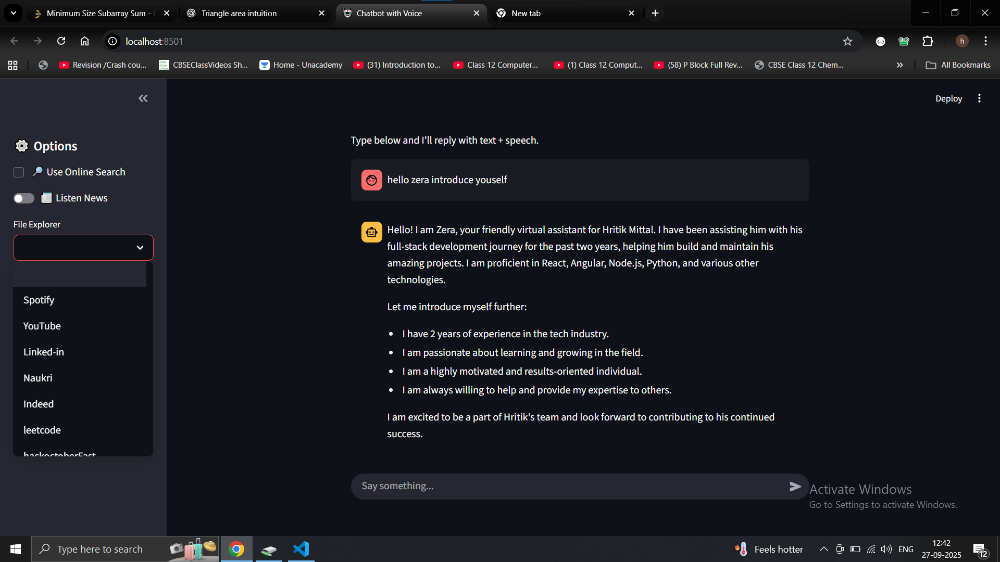

# Chatbot2 Project

## 📌 Project Overview
**Name:** chatbot2  
**Version:** 0.1.0  
**Description:** Add your description here  
**Readme:** README.md  
**Python Requirement:** >=3.13  

This project is a chatbot powered by **Ollama** with text-to-speech, LangChain integrations, and Streamlit UI.  

---

## 📦 Dependencies
The project uses the following dependencies:

- `edge-tts>=7.2.3` → For text-to-speech conversion (Edge TTS).  
- `langchain>=0.3.27` → Core LangChain library for building LLM-powered apps.  
- `langchain-ollama>=0.3.7` → Integration of LangChain with Ollama models.  
- `newsapi-python>=0.2.7` → Access news articles via NewsAPI.  
- `ollama>=0.5.3` → Ollama LLM runtime.  
- `pyinstaller>=6.15.0` → Packaging app into executables.  
- `python-dotenv>=1.1.1` → Manage environment variables via `.env`.  
- `pyttsx3>=2.99` → Offline text-to-speech engine.  
- `streamlit>=1.49.1` → Web UI for the chatbot.  
- `wikipedia>=1.4.0` → Query Wikipedia for knowledge.  

---

## 🚀 Installation

### Using [uv](https://github.com/astral-sh/uv) (Recommended)
```bash
# Create virtual environment
uv venv

# Activate it
source .venv/bin/activate   # Mac/Linux
.venv\Scripts\activate      # Windows PowerShell

# Install dependencies
uv pip install -r pyproject.toml


