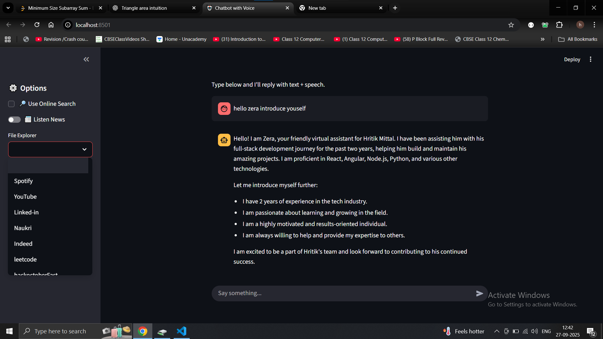

# 🤖 Zera Virtual Assistant Project

---

## 📌 Project Overview

**Version:** 0.1.0  
**Description:**  
**Zera** is an intelligent, voice-enabled AI chatbot powered by **Ollama** and **LangChain**, featuring real-time text-to-speech, knowledge retrieval, and an elegant **Streamlit** web interface.  
It can chat naturally, read responses aloud, and dynamically fetch information from the web and Wikipedia.

**Readme:** README.md  
**Python Requirement:** >=3.13  

This project is a chatbot powered by **Ollama** with **text-to-speech**, **LangChain** integrations, and a **Streamlit UI**.

---

## 📦 Dependencies

The project uses the following dependencies:

| Dependency | Version | Purpose |
|-------------|----------|----------|
| `edge-tts` | >=7.2.3 | For text-to-speech conversion (Edge TTS) |
| `langchain` | >=0.3.27 | Core LangChain library for building LLM-powered apps |
| `langchain-ollama` | >=0.3.7 | Integration of LangChain with Ollama models |
| `newsapi-python` | >=0.2.7 | Fetch real-time news articles |
| `ollama` | >=0.5.3 | Ollama LLM runtime |
| `pyinstaller` | >=6.15.0 | Package app into executable format |
| `python-dotenv` | >=1.1.1 | Manage environment variables |
| `pyttsx3` | >=2.99 | Offline text-to-speech engine |
| `streamlit` | >=1.49.1 | Web-based UI for the chatbot |
| `wikipedia` | >=1.4.0 | Retrieve knowledge from Wikipedia |

---



---

## 🚀 Installation

### Using [uv](https://github.com/astral-sh/uv) (Recommended)

```bash
# 1️⃣ Create a virtual environment
uv venv

# 2️⃣ Activate the environment
source .venv/bin/activate   # For Mac/Linux
.venv\Scripts\activate      # For Windows PowerShell

# 3️⃣ Install all dependencies
uv pip install -r pyproject.toml
```

---

## 🧠 Model Setup (Ollama)

1. **Install Ollama**  
   Download from the official site → [https://ollama.ai/download](https://ollama.ai/download)

2. **Verify Installation**
   ```bash
   ollama --version
   ```

3. **Create the Zera Model**  
   Go to the `config/` folder which contains your Ollama model file (e.g., `zera_model.ollama`), then run:
   ```bash
   ollama create zera -f config/zera_model.ollama
   ```

4. **Test the Model**
   ```bash
   ollama run zera
   ```

---

## 🔑 Environment Setup

1. Duplicate `.env.example` → rename it to `.env`  
2. Add your API keys and configurations inside `.env`:
   ```env
   NEWS_API_KEY=your_newsapi_key_here
   OLLAMA_MODEL=zera
   ```

---

## 🗂️ File Explorer Setup

Zera supports a **File Explorer** feature that lets you open apps and websites directly by voice or chat command.

### Step 1: Create `filepaths.json`

In the **root of your project**, create a file named `filepaths.json` and add your desired app paths and URLs:

```json
{
  "Spotify": "C:\\Users\\Lenovo\\AppData\\Roaming\\Spotify\\Spotify.exe",
  "YouTube": "https://www.youtube.com/",
  "Linked-in": "https://www.linkedin.com/feed/",
  "Naukri": "https://www.naukri.com/mnjuser/homepage",
  "Indeed": "https://in.indeed.com/",
  "leetcode": "https://leetcode.com/problemset/",
  "hacktoberfest": "https://hacktoberfest.com/profile/",
  "coursera-rag": "https://www.coursera.org/learn/retrieval-augmented-generation-rag/"
}
```

> 💡 **Tips:**
> - For **desktop apps** → use the full `.exe` path (Windows) or app path (Mac/Linux)
> - For **websites** → use the full URL starting with `https://`
> - Use double backslashes `\\` for Windows paths
> - Key names are case-insensitive when Zera searches them

---

### Step 2: How Zera Uses It

Zera reads `filepaths.json` at startup and maps each key to its path. When you say or type something like:

```
User: Open Spotify
User: Open YouTube
User: Open leetcode
```

Zera will:
- **Desktop apps** → launch the `.exe` directly using `subprocess` or `os.startfile`
- **URLs** → open in your default browser using `webbrowser.open()`

---

### Step 3: Add More Entries Anytime

Simply edit `filepaths.json` and add a new line:

```json
{
  "GitHub": "https://github.com/",
  "VS Code": "C:\\Users\\Lenovo\\AppData\\Local\\Programs\\Microsoft VS Code\\Code.exe"
}
```

No restart needed if Zera reloads the file dynamically.

---

### 📁 File Explorer: Project Structure

```
zera/
├── filepaths.json          # ← Your app & URL shortcuts
├── modules/
│   └── file_explorer.py    # ← Handles open commands
└── ...
```

---

## ▶️ Run the Application

Once all dependencies and models are ready, start the chatbot:
```bash
python main.py
```

Then open the local Streamlit app (usually: [http://localhost:8501](http://localhost:8501))  
Enjoy chatting with **Zera – Your Personal AI Assistant** 🎙️🤖

---

## 💻 Usage

Once running, **Zera** can:
- 🗣️ Talk with you using natural speech (Edge TTS or pyttsx3).  
- 💬 Respond intelligently using Ollama's LLM models.  
- 🌐 Fetch live news or knowledge using NewsAPI and Wikipedia.  
- 🗂️ Open apps and websites via the File Explorer feature.  
- 🎨 Provide a clean, interactive UI with Streamlit.  

Example commands:
```
User: What's the latest news about AI?
Zera: Fetching the most recent updates from trusted sources...

User: Open Spotify
Zera: Opening Spotify for you! 🎵

User: Open leetcode
Zera: Launching LeetCode in your browser! 💻
```

---

## 🧰 Project Structure

```
zera/
├── config/
│   ├── zera_model.ollama        # Ollama model definition
│   └── settings.env.example     # Example environment file
├── filepaths.json               # App & URL shortcuts for File Explorer
├── main.py                      # Entry point for the app
├── modules/
│   ├── speech_engine.py         # Text-to-speech logic
│   ├── llm_handler.py           # Ollama + LangChain integration
│   ├── news_fetcher.py          # Fetch latest news
│   ├── wiki_handler.py          # Wikipedia search utility
│   └── file_explorer.py         # File Explorer / app launcher
├── requirements.txt / pyproject.toml
├── README.md
└── .env
```

---

## 🧩 Features

✅ **Voice-enabled conversations**  
✅ **Offline and online speech synthesis**  
✅ **LangChain-powered reasoning**  
✅ **Dynamic web + Wikipedia knowledge retrieval**  
✅ **File Explorer — open apps & websites by voice**  
✅ **Clean Streamlit UI**  
✅ **Cross-platform support (Windows / Mac / Linux)**  

---

## 🏗️ Build Executable (Optional)

To package the app as a standalone executable:

```bash
pyinstaller --noconfirm --onefile --windowed main.py
```

The build output will be in the `dist/` folder.

---

## 🧑‍💻 Author

**Hritik Mittal**  
💼 Full Stack Developer | AI & Automation Enthusiast  
🌐 [GitHub](https://github.com/hritikmittal09)

---

## 🪪 License

This project is licensed under the **MIT License** — you're free to use, modify, and distribute it with attribution.

---

*Zera – Speak. Learn. Connect.* ⚡